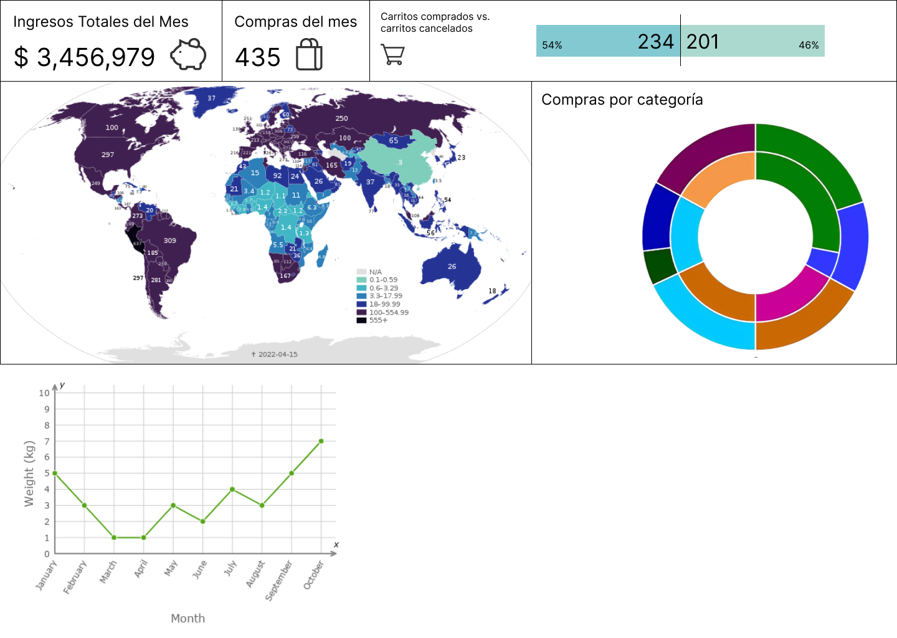

# Plantilla SolidJS Stackblitz

El boilerplate de esta interfaz se generó a partir de la plantilla de SolidJS + Vite de Stackblitz

[Editar en Stackblitz?](https://stackblitz.com/edit/solidjs-template)

# Mockup Dashboard

Elaborado en Figma, un dashboard que posteriormente será generado a través de PowerBI o alguna plataforma similar.

